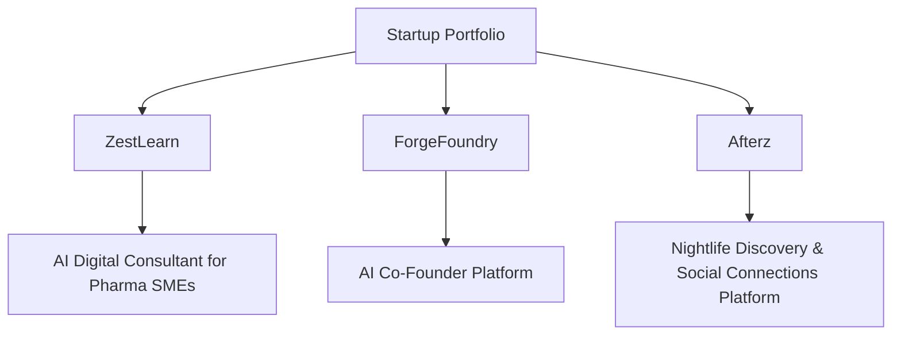
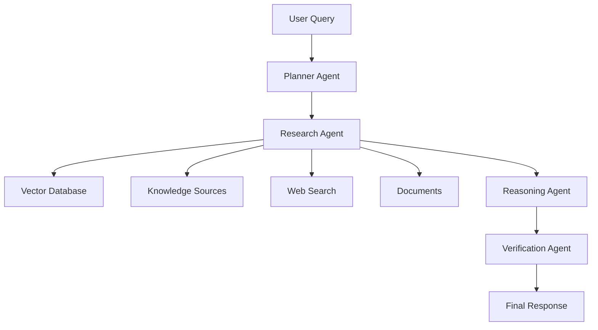

# 🤖 Chirag Natesh Vijay

### AI Engineer • Agentic AI Builder • Entrepreneur

<p align="center">


</p>

<p align="center">


</p>

<p align="center">


</p>

---

# 🧠 About Me

I am an **AI Engineer and Startup Builder** focused on building **intelligent systems that collaborate, reason, and automate complex workflows**.

My interests include:

* 🤖 Agentic AI systems
* 🔎 Retrieval-Augmented Generation (RAG)
* 🧠 Machine Learning & Deep Learning
* 📊 Data engineering & AI pipelines
* 🚀 AI startups & digital products

Previously worked on **machine learning systems at Bosch**, and currently building **AI products and startups within the German startup ecosystem**.

---

# 🚀 Startup Builder Portfolio



---

# 🌱 Current Ventures

## 🧬 ZestLearn

AI-powered **Digital Consultant for Pharma & Biotech SMEs**

Helps companies adopt AI across:

* R&D workflows
* regulatory decision support
* operational intelligence
* knowledge automation

Built using **multi-agent AI systems and collective intelligence frameworks**.

---

## 🏗 ForgeFoundry

An **AI Co-Founder platform** that helps founders build startups faster.

Automatically generates:

* market research
* business models
* go-to-market strategies
* investor pitch decks
* startup documentation

Powered by **agentic LLM workflows and automation pipelines**.

---

## 🌙 Afterz

**Afterz** is a platform designed to make **nightlife more accessible and social**.

It helps users:

* discover nightlife events nearby
* connect with people attending the same events
* make spontaneous plans and build new social connections

Mission:
Make nightlife **more discoverable, social, and inclusive**.

---

# 🤖 Agentic AI System Architecture

Example architecture of the **multi-agent AI systems I design**.



Core principles:

* LLM reasoning
* retrieval pipelines
* autonomous agents
* answer verification

---

# 🧩 Featured AI Projects

### 🧠 MedAssist MAS

Multi-agent **AI healthcare triage system**

Agents collaborate to:

* analyze symptoms
* detect medical red flags
* provide medical guidance
* escalate emergencies

---

### 📄 DocChat

Multi-agent **RAG document assistant**

Capabilities:

* intelligent document retrieval
* grounded answers
* hallucination reduction
* context-aware reasoning

---

### 📊 Autonomous Data Scientist

Agentic AI system that automatically:

* loads datasets
* performs EDA
* trains ML models
* generates insights

Works with **CSV / Excel datasets**.

---

### 🥗 AI NourishBot

Computer vision system that:

* recognizes food items
* estimates calories
* provides nutrition insights

---

### 🎵 Jazz Music Generator

LSTM neural network generating **jazz piano sequences**.

Explores:

* sequence modeling
* generative music
* neural creativity

---

# 🛠 Tech Stack

## Programming


---

## Machine Learning


---

## Generative AI


---

## Agentic AI Frameworks


---

## RAG & Retrieval Systems


---

## AI Applications


---


# 🛠 Tech Stack

## 💻 Programming

<p>

</p>

---

# 🤖 AI & Machine Learning

<p>

</p>

Libraries & Tools

```
HuggingFace Transformers • SpaCy • OpenCV • Scikit-learn • Optuna • InterpretML
```

Used for **deep learning, model optimization, and explainable AI**. 

---

# 🧠 Generative AI & Agentic AI

```
LangChain • LangGraph • LlamaIndex • smolagents
```

Platforms & Models

```
Stable Diffusion • ElevenLabs • HuggingFace Models
```

Used for building **RAG pipelines, multi-agent AI systems, and generative AI applications**. 

---

# 📊 Data Science & Analytics

<p>

</p>

```
Pandas • NumPy • Matplotlib • Seaborn • Plotly
```

Used for **data processing, model evaluation, and visualization**. 

---

# ⚙️ MLOps & Infrastructure

<p>

</p>

```
Azure ML • Apache Spark • Hadoop
```

Used for **scalable ML pipelines and distributed data processing**. 

---

# 🗄 Databases & Vector Stores

<p>

</p>

```
ChromaDB
```

Used for **structured storage and vector retrieval in RAG systems**. 

---

# 🌐 Backend & AI Applications

<p>

</p>

AI app frameworks

```
Streamlit • Gradio • Dash
```

Used for **AI applications, APIs, dashboards, and ML prototypes**. 

---

# 🌐 Web Development

<p>

</p>

Frameworks

```
Flask • Django • ASP.NET
```

---

# 🔧 Dev Tools

<p>

</p>

```
Jira • Confluence • Cursor
```

Used for **version control, Agile development, and collaboration**. 

---

# 🌍 IoT & Edge Systems

```
Arduino • Node-RED • Blynk • MQTT • REST APIs
```

Used in **IoT automation and edge-device systems**. 

---


# 📊 GitHub Stats

<p align="center">


</p>

---

# 📈 Most Used Languages

<p align="center">


</p>

---

# 🐍 Contribution Snake

Add this GitHub Action to enable contribution animation.

```
https://raw.githubusercontent.com/PRONGS-CHIRAG/PRONGS-CHIRAG/output/github-contribution-grid-snake.svg
```

---

# 🧪 Research Interests

* Agentic AI Systems
* Autonomous AI Engineers
* Explainable AI
* AI for Healthcare
* Collective Intelligence Systems

---

# 📷 Beyond AI

Outside technology I enjoy:

📷 Photography
🌍 Travel
🎹 Music

---

# 🤝 Let's Collaborate

I’m always interested in collaborating on:

* AI engineering projects
* agentic AI systems
* research
* startups

---

⭐ If you like my work, feel free to **explore my repositories and star projects**.


---
