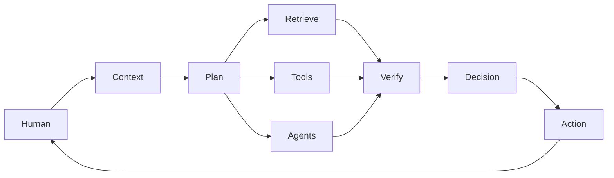

<div align="center">


### I like turning messy real-world problems into systems that can think, decide and act.

<br>

[](https://www.chiragnvijay.me/)
[](https://www.linkedin.com/in/chiragnvijay)
[](https://github.com/PRONGS-CHIRAG)

</div>

<br>

```text
          engineer things
               ↓
        question assumptions
               ↓
          build weird prototype
               ↓
             break it
               ↓
         understand why
               ↓
       turn it into a system
               ↓
         maybe start a company
```

---

## `01 / hello, world`

I'm **Chirag** — an AI engineer, entrepreneur and compulsive builder based in Germany.

I'm particularly interested in the point where AI stops being a chatbot and starts becoming a **system**:

> one that understands context, retrieves evidence, uses tools, collaborates with other agents, verifies its own work and helps humans make better decisions.

These days, most of my energy goes into three things:

**building AI systems · building companies · bringing interesting people together**

---

## `02 / currently building`

<table>
<tr>
<td width="50%" valign="top">

<h3>🧬 Cellvara</h3>

<b>Decision intelligence for life-science R&D.</b>

Research rarely fails because scientists don't have information.

The harder problem is figuring out:

<i>What matters here? What went wrong? What should I try next? What evidence supports that?</i>

Cellvara explores AI systems that can reason across experimental context and scientific evidence to help researchers troubleshoot and navigate R&D workflows.

<br>

<b>Currently exploring</b>

→ failed-experiment troubleshooting
→ scientific evidence retrieval
→ experiment-context understanding
→ grounded recommendations
→ explainable AI for biotech & pharma

<br>

<code>AI × Science × Decision Intelligence</code>

</td>

<td width="50%" valign="top">

<h3>🧪 BioAnkor</h3>

<b>An intelligent inventory layer for laboratories.</b>

Labs contain thousands of samples.

Unfortunately, their location is sometimes encoded in the ancient knowledge system known as:

<b>"ask the person who put it there."</b>

BioAnkor is exploring a smarter way to understand laboratory inventory — what exists, where it is stored and what happened to it.

<br>

<b>Currently exploring</b>

→ intelligent sample tracking
→ natural-language inventory search
→ OCR-assisted vial identification
→ visual freezer / storage maps
→ traceable sample movement

<br>

<code>AI × Computer Vision × Lab Operations</code>

</td>
</tr>
</table>

---

## `03 / building systems, not wrappers`

A lot of the AI systems I enjoy building look less like:

```text
prompt → LLM → answer
```

and more like:


```mermaid
flowchart LR

H["Human"]
C["Context"]
P["Plan"]
R["Retrieve"]
T["Tools"]
A["Agents"]
V["Verify"]
D["Decision"]
X["Action"]

H --> C
C --> P

P --> R
P --> T
P --> A

R --> V
T --> V
A --> V

V --> D
D --> X
X --> H
```

The interesting engineering questions live between those boxes.

**How does an agent know it is wrong?**

**What should be deterministic and what should be probabilistic?**

**Where does the source of truth live?**

**How do multiple agents collaborate without creating an expensive group chat of hallucinations?**

That's the part I enjoy.

---

## `04 / experiments from the lab`

### ⚡ Multi-Agent PCB Engineering

Exploring an AI engineering team modeled around real PCB roles — design, analysis, validation, testing and QA — with **KiCad acting as the source of truth** for whether agent actions are actually valid.

`agents → tools → engineering software → verification`

---

### 🔬 AI for Scientific Work

Building and experimenting with workflows around:

```text
literature
    ↓
evidence
    ↓
hypothesis
    ↓
experiment
    ↓
failure
    ↓
reasoning
    ↓
next experiment
```

The goal isn't to automate scientists.

It's to give them better cognitive infrastructure.

---

### 🧠 Autonomous AI Workflows

Prototypes where AI agents can:

`plan → retrieve → execute → inspect → verify → retry`

instead of following one giant prompt and hoping for the best.

---

### 📊 Machine Learning × Human Perception

For my Master's thesis with **Bosch eBike Systems**, I worked on predicting characteristics of perceived e-bike motor sound using vibration data, machine learning, optimization and explainability.

A nice reminder that sometimes the hardest target variable lives inside a human head.

---

### 🚁 Before LLMs ate my GitHub

Earlier work included a patented **hexacopter crop-care system** combining sensing, automation and intelligent agricultural applications.

Apparently I have been trying to make machines do things autonomously for a while.

---

## `05 / offline mode`

Not everything interesting happens behind a screen.

I also run a **local, in-person founders meetup in Augsburg**.

The idea is intentionally simple:

```text
less
"networking event"

more
"interesting people sitting together,
sharing what they're building,
what's failing,
and helping each other move forward"
```

It's a small experiment in building the kind of entrepreneurial community I personally like being part of — **informal, curious, collaborative and human**.

Because sometimes the highest-bandwidth API is still putting people in the same room.

---

## `06 / the toolbox`

I care less about collecting logos and more about knowing **when a tool should — and shouldn't — be used.**

### AI / ML


### Agentic systems


### Building things around them


<br>

`RAG` · `tool use` · `structured generation` · `vector search` · `MCP` · `computer vision` · `agent orchestration` · `evaluation` · `XAI` · `ML pipelines`

---

## `07 / current rabbit holes`

```text
AI agents that can actually verify themselves   ███████████████████░
AI for scientific discovery                     ████████████████████
decision intelligence                           ██████████████████░░
human × AI collaboration                        ███████████████████░
multi-agent system architecture                 ██████████████████░░
understanding intelligence itself               ████████████████████
not starting another side project               ██░░░░░░░░░░░░░░░░░░
```

---

## `08 / somewhere along the way`

```text
                         ┌────────────────────┐
                         │      BUILDING      │
                         └─────────┬──────────┘
                                   │
                ┌──────────────────┼──────────────────┐
                ↓                  ↓                  ↓
          AI ENGINEERING        STARTUPS          COMMUNITY
                │                  │                  │
             Hilti             Cellvara           Augsburg
             Bosch             BioAnkor            Founders
                │                  │               Meetups
                └──────────────────┼──────────────────┘
                                   ↓
                              EXPERIMENTS
                                   │
                      research • agents • products
```

My path has moved through **machine learning, explainable AI, autonomous systems, agentic AI and entrepreneurship**.

Currently working on applied AI at **Hilti**.

Previously worked on machine-learning systems at **Bosch eBike Systems**.

Somewhere in between: research, hackathons, startup programs, prototypes and an impressive number of repositories called things like `final_v2_actual_final`.

---

## `09 / the non-AI part`

My GitHub probably gives the impression that I spend my entire life talking to computers.

This is only partially true.

<table>
<tr>
<td width="25%" align="center">

### 📷

**Photography**

Street
Architecture
People
Stories

</td>

<td width="25%" align="center">

### ✍️

**Poetry**

For things that
don't fit nicely
inside JSON.

</td>

<td width="25%" align="center">

### 🔭

**Science**

Physics
Genetics
Psychology
Neuroscience

</td>

<td width="25%" align="center">

### 🎵

**Music**

Listening
Exploring
Occasionally
creating

</td>
</tr>
</table>

I like things that sit between **logic and creativity**.

Which probably explains both the AI engineering and the photography.

---

## `10 / GitHub telemetry`

<details>

<summary><b>Open the unnecessarily serious statistics department</b></summary>

<br>

<div align="center">


<br><br>


</div>

</details>

---

## `11 / ping me if...`

You're working on:

→ **Agentic AI**
→ **AI for Science**
→ **AI infrastructure & evaluation**
→ **Biotech / laboratory software**
→ **Startups**
→ **something ambitious that doesn't fit neatly into a category**

Or you're simply in Augsburg and building something interesting.

<div align="center">

<br>

### `human.connect(chirag)`

[](https://www.linkedin.com/in/chiragnvijay)

[](https://www.chiragnvijay.me/)

<br>

```text
stay curious.
build strange things.
test them against reality.
```

<sub>↑ more or less the operating system</sub>

</div>
